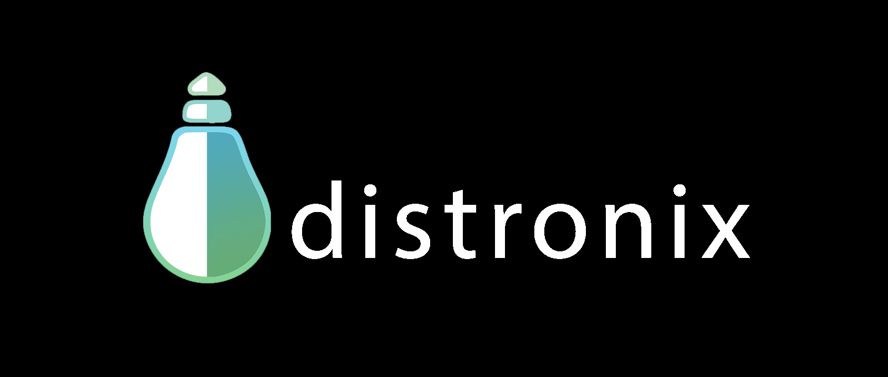

# Work Experience

[**Home**](index.md) | [**Projects**](projects.md) | [**Publications**](publication.md) | [**Work Experience**](experience.md) | [**About Me**](./index.md#about-me)

[**Resume**](/pdf/Aninda%20Ghosh%20-%20Resume.pdf)

## Graduate Research Assistant | Aug 2023 - Present 


This work involves extending the work of Field Boundary Delineation to create new datasets and identify benchmarking metrics for those datasets. The scarcity of data plagues this domain from adapting DL architectures full-fledgedly. 

The research effort is funded by "NASA (Harvest)" for developing benchmark datasets & evaluation metrics in a collaboration with "MLCommons".This work involves extending the work of Field Boundary Delineation to create new datasets and identify benchmarking metrics for those datasets. The scarcity of data plagues this domain from adapting DL architectures full-fledgedly. The research effort is funded by "NASA (Harvest)" for developing benchmark datasets & evaluation metrics in a collaboration with "MLCommons".

```
Datasets · Machine Learning · Deep Learning · Artificial Intelligence (AI) · Research and Development (R&D) · Python (Programming Language) · OpenCV · Computer Vision
```

## Graduate Student Assistant | May 2023 - Aug 2023


I was fortunate to work in satellite imagery, where the part of AI is creeping in to solve some real-world problems. One such problem statement is Field Boundary Delineation. To tackle the problem statement, we worked on finding a suitable deep-learning architecture, which was fine-tuned with a few samples from a few regions. The target was to create a generalizable model for different geographic locations.

1. Dived deeper into ViT architecture while working on SAM (By Facebook AI Research Group)
2. Created a unified data format to deal with different types of data sources like Google Earth Engine and other publicly available sources.
3. Created an end-to-end DeepLearning pipeline for CNN-guided SAM architecture.

```
PyTorch · Machine Learning · Deep Learning · Artificial Intelligence (AI) · Research and Development (R&D) · Python (Programming Language) · OpenCV · Computer Vision · Python
```

## Machine Learning Researcher (Fractional CTO) | Nov 2020 - Apr 2023


Worked towards creating a harmonized process flow with Design, Develop, and Produce in mind for Smart Helmets. As a Machine Learning Researcher, while being the Fractional CTO, I was responsible for the tech supporting the business. I have worn multiple hats working here, but I specialized in the Embedded Domain while getting exposure to machine learning model development and data preparations.

1. Developed and Deployed Deep Learning (Transformer) Accident and Human Activity Recognition in a Mobile environment. Adapted the BERT model with architecture changes for IMU sensor data.
2. I led the Embedded Systems Team to develop Smart Helmet embedded software according to MISRA-C guidelines.
3. Working with the Co-Founders to head the tech team while providing insights for future directions. Leading a team of 10+ people working in the Software, Embedded, and Hardware team.

```
Analytical Skills · Project Management · Software Development · Technical Leadership · Cross-functional Team Leadership · Business Decision Making · Strategic Planning · Technology Integration · Leadership · Amazon Web Services (AWS)
```

## Senior Application Engineer | Apr 2020 - Oct 2020


Fascinated by Cloud Technology, I joined L&T Technology Solution with my expertise in AWS and worked with the solution architect to do rapid POCs and validation for production-level deployment. While doing so, I learned quite a bit about the production-level deployment process flow. 


1. I Jointly worked with the JAVA dev team to validate POCs on the Micro-service architecture for a product named Statusscope, intended to connect various MRI machines to be operated remotely. 
I developed a data analysis pipeline with Kafka, AWS Glue, and AWS Athena to automate report generation, which removed the manual report generation process and reduced the reporting time by 70%.
2. After finishing my first project, Statuscope, I was moved to a new project within a few days to facilitate a new team on cloud deployments in Kubernetes.
3. There, I Improved the pod deployment by automating the process using helm charts, thus improving the CICD pipeline.

```
Analytical Skills · Software Development · Technology Integration · SQL · Cloud Computing · Kubernetes · Docker · Helm Charts · Python (Programming Language) · Internet of Things (IoT) · Python · Amazon Web Services (AWS) · AWS IoT
```

## Senior Research And Development Engineer | Aug 2016 - Mar 2020


Served as a critical member of Distronix, a Kolkata-based Technology Startup since its inception; responsibilities were simultaneously spanned across various verticals, which were both diverse and challenging. Primary Responsibilities were embedded software development, server-side programming, and IoT network designing. Simultaneously, I was involved in Project Planning, Delegation of responsibilities, Client Handling, and Recruitment.

1. Led a team of 5 to manage small-scale manufacturing and deployments.
2. Designed a low-latency communication stack for a 2G network, achieving high data compression during transmission.
3. Expedited the development timeline by providing research insights on the microcontrollers and their development environment.
4. Ported open-source Pub-Sub stack to a custom RTOS for efficient data transmission over Kafka stream.

```
Joint Test Action Group (JTAG) · Embedded C · C++ · Analytical Skills · Software Development · Technical Leadership · Technology Integration · Embedded Software Programming · Embedded Systems · Bluetooth Low Energy Solutions · Python (Programming Language) · Internet of Things (IoT) · Real-Time Operating Systems (RTOS) · Python · Amazon Web Services (AWS) · AWS IoT
```