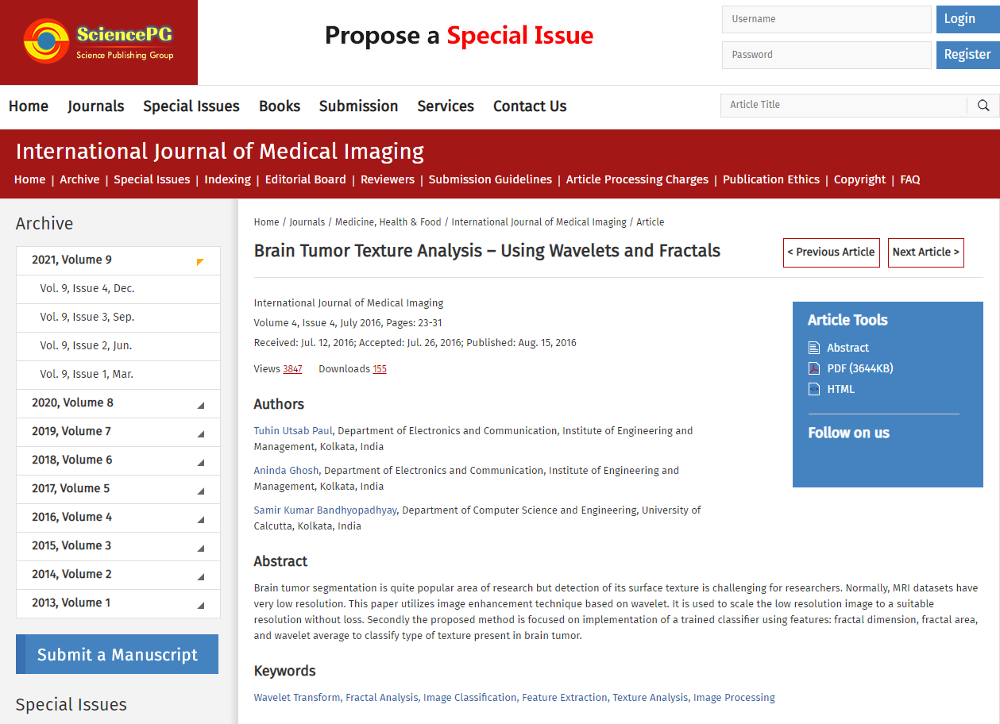

# (Journal Paper) Brain Tumor Texture Analysis – Using Wavelets and Fractals

## Paper Description

Brain tumor segmentation is quite popular area of research but detection of its surface texture is challenging for researchers. Normally, MRI datasets have very low resolution. This paper utilizes image enhancement technique based on wavelet. It is used to scale the low resolution image to a suitable resolution without loss. Secondly the proposed method is focused on implementation of a trained classifier using features: fractal dimension, fractal area, and wavelet average to classify type of texture present in brain tumor.

- https://www.sciencepublishinggroup.com/journal/paperinfo.aspx?journalid=156&doi=10.11648/j.ijmi.20160404.11

